# Calculadora Digital en Verilog

## Universidad Nacional De Colombia - Electrónica Digital I

## Autores

 *Samuel Felipe Hernández Herreño - 102740044*

*Steven Sebastian Osorio Castro - 1022922007*

*Daniel Santiango Puentes Villabona - 1052378730*


Este proyecto implementa una calculadora digital basada en un SoC, desarrollada en Verilog y probada en FPGA. 
La calculadora ejecuta una operación seleccionada y finalmente transforma el resultado a decimal para su rápida lectura.

Las operaciones implementadas son:

- Multiplicación binaria

- División binaria

- Raíz cuadrada binaria

- Conversión Binario → BCD (Decimal Codificado Binario)

Las cuatro operaciones fueron construidas siguiendo la metodología del curso:

- Diagrama de flujo del algoritmo

- Diagrama máquina de estados

- Camino de datos y unidad de control

- Interconexión como periféricos en un SoC

- Simulación con Iverilog y GTKWave

- Implementación final en FPGA

#### Estructura Abreviada del Proyecto

```Bash
\design
  \firmware
    \asm
      ...
      calculator.S
  \rtl
    \peripheral_implementation
      \*_perip
        \diagrams
        \simulation
        \test_benches
        Makefile
        peripheral_*.v
    \raw_implementation
      \*_ASM
        \diagrams
        \simulation
        \test_benches
        Makefile
        *.v
    \system_on_chip
      ...
      SOC.v
```
Los módulos principales pueden consultarse aquí:

- Multiplicador
  - [Periferico](./rtl/peripheral_implementation/mult_perip/peripheral_mult.v)
  - [Modulo](./rtl/raw_implementation/mult_ASM/mult_32.v)
  - [Driver](./firmware/asm/mult.S)
- Divisor
  - [Periferico](./rtl/peripheral_implementation/divider_perip/peripheral_div.v)
  - [Modulo](./rtl/raw_implementation/divider_ASM/div_16.v)
  - [Driver](./firmware/asm/div.S)
- Raiz Cuadrada
  - [Periferico](./rtl/peripheral_implementation/raiz_perip/peripheral_raiz.v)
  - [Modulo](./rtl/raw_implementation/raiz_ASM/raiz_16.v)
  - [Driver](./firmware/asm/sqrt.S)
- Binary to BCD
  - [Periferico](./rtl/peripheral_implementation/BCD_perip/peripheral_BCD.v)
  - [Modulo](./rtl/raw_implementation/BCD_ASM/BIN_TO_BCD.v)
  - [Driver](./firmware/asm/bin_to_bcd.S)
- UART
  - [Periferico](./rtl/peripheral_implementation/uart_perip/peripehral_uart.v)
  - [Modulo](./rtl/raw_implementation/uart/uart.v)
  - [Driver](./firmware/asm/getchar.S)
- [Sistema en Silicio](./rtl/system_on_chip/SOC.v)
  - [Firmware](./firmware/asm/calculator.S)
#### Arquitectura General

El sistema está basado en un procesador conectado a cuatro periféricos dedicados.
El Address Decoder asigna un rango de direcciones a cada uno:

| Periférico | Dirección base |
| ---------- | -------------- |
| UART       | `0x400000`     |
| Raíz       | `0x410000`     |
| Mult       | `0x420000`     |
| Div        | `0x430000`     |
| BIN→BCD    | `0x440000`     |

A continuación se muestra la arquitectura final del SoC:

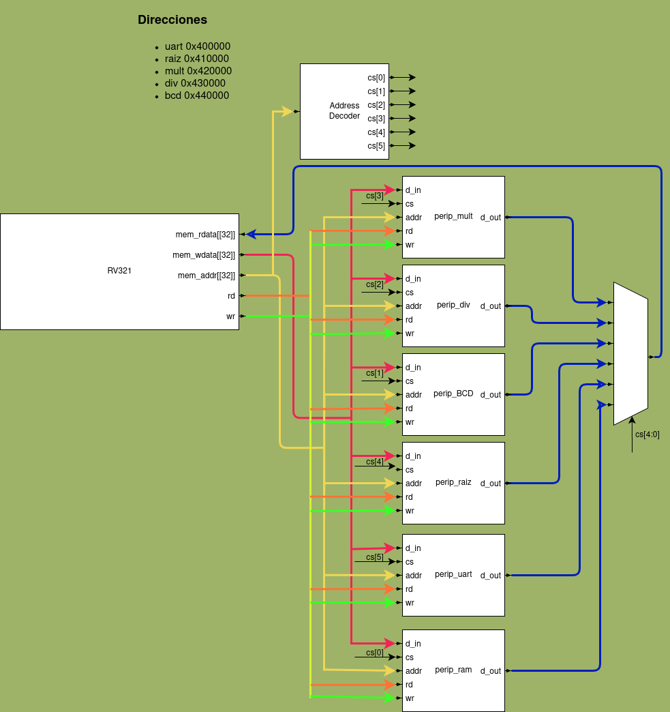

#### Periférico Raíz Cuadrada
Código
- [Periferico](./rtl/peripheral_implementation/raiz_perip)
- [Modulo](./rtl/raw_implementation/raiz_ASM)

Direcciones asignadas

| Registro | Dirección   | Descripción |
| -------- | ----------- | ----------- |
| RR       | `0x410004`  | Radicando|  
| init     | `0x410008`  | Iniciar|
| R        | `0x41000C`  | Raiz|
| Q        | `0x410010`  | Resto|
| done     | `0x410014`  | Terminado|

Diagramas

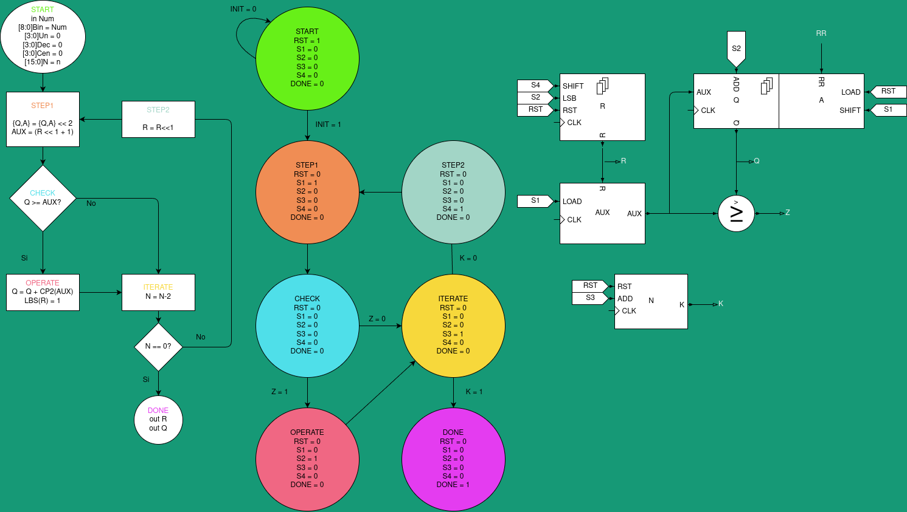

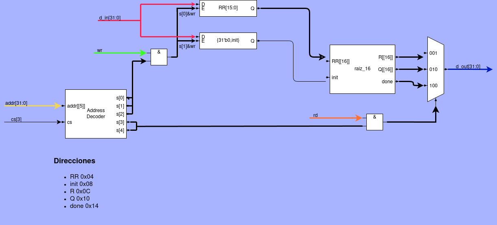


#### Periférico División
Código
- [Periferico](./rtl/peripheral_implementation/divider_perip/)
- [Modulo](./rtl/raw_implementation/divider_ASM/)

Direcciones asignadas

| Registro | Dirección   | Descripción |
| -------- | ----------- | ----------- |
| A        | `0x430004`  | Dividendo   |  
| B        | `0x430008`  | Divisor     |
| init     | `0x43000C`  | Iniciar     |
| R        | `0x430010`  | Cociente   |
| done     | `0x430014`  | Terminado   |

Diagramas

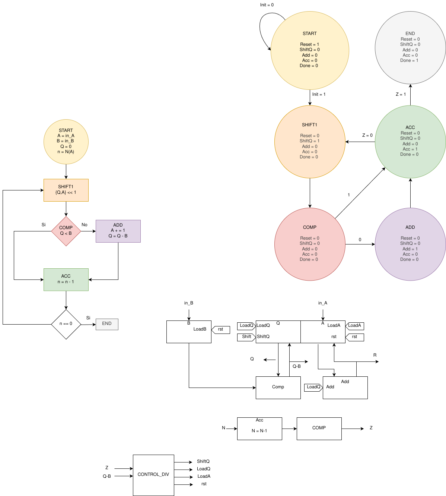


#### Periférico Multiplicación
Código
- [Periferico](./rtl/peripheral_implementation/divider_perip/)
- [Modulo](./rtl/raw_implementation/divider_ASM/)

Direcciones asignadas

| Registro | Dirección   | Descripción  |
| -------- | ----------- | -----------  |
| A        | `0x420004`  | Multiplicando|  
| B        | `0x420008`  | Multiplicador|
| init     | `0x42000C`  | Iniciar      |
| R        | `0x420010`  | Producto     |
| done     | `0x420014`  | Terminado    |

Diagramas

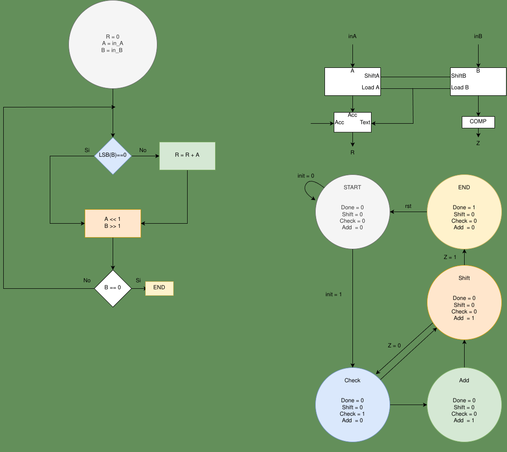

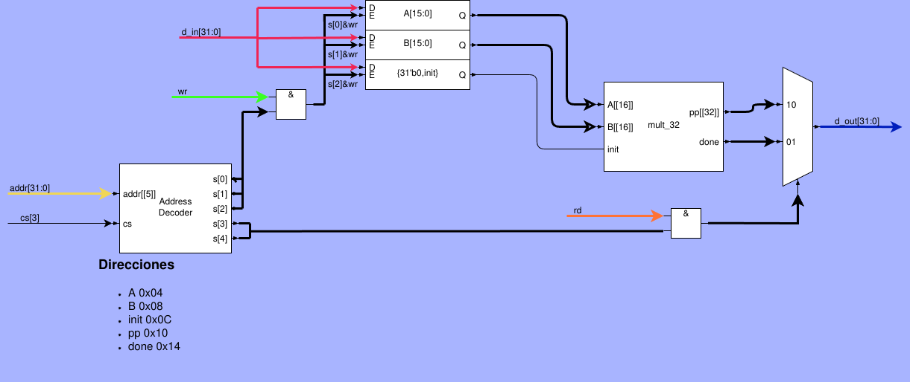


#### Conversión BIN → BCD

Direcciones:

| Registro | Dirección  | Descripción |
| -------- | ---------- | ----------- |
| BIN      | `0x440004` | Representacion binaria |
| init     | `0x440008` | Iniciar     |
| UND      | `0x44000C` | Unidades    |
| DEC      | `0x440010` | Decenas     |
| CEN      | `0x440014` | Centenas    |
| DONE     | `0x440018` | Terminado   |

Diagramas

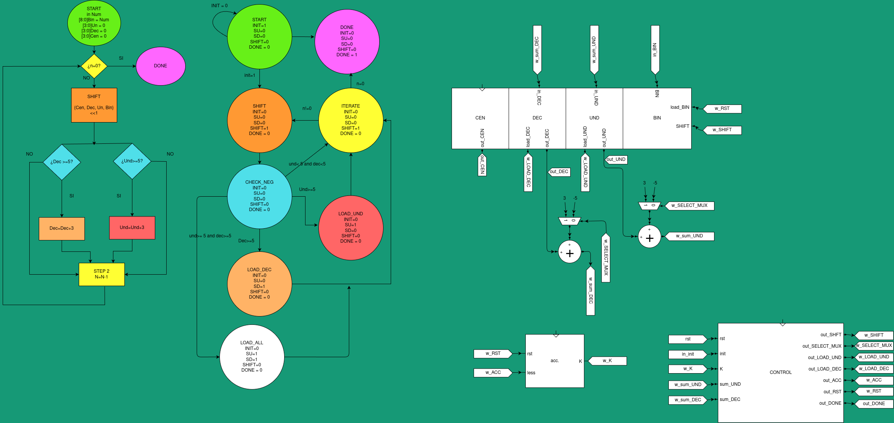

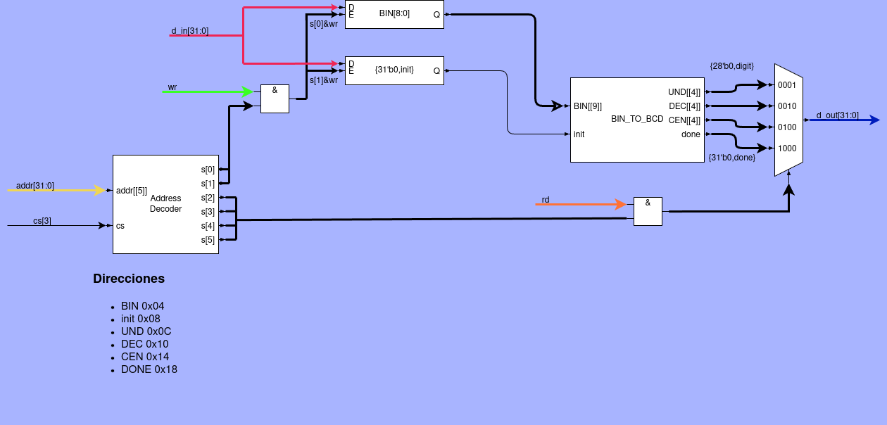


#### Simulación
Para cada modulo y su periferico se puede obtener una simulación simple y una simulación luego de sintetizar a la FPGA objetivo.

Se utiliza `iverilog` para compilar los archivos fuente en Verilog y `gtkwave` para visualizar los resultados. 


Ejemplo simulación simple:
```bash
[raiz_ASM] $ make simple_sim
```
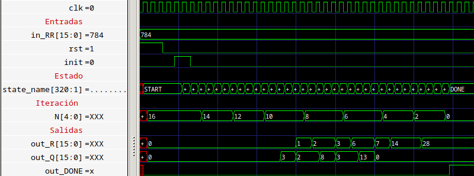

Ejemplo simulación luego de síntesis:
```bash
[raiz_ASM] $ make sim_post_synth
```
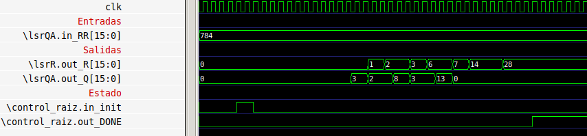


Tambien se simula el sistema completo de la siguiente manera :
```bash
[system_on_chip] make sim_quark
```
Resultado en consola de la simulación de el sistema:
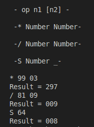

#### Implementación en FPGA

Luego de la simulación, el sistema completo fue cargado en una FPGA Lattice ECP5 incluida en la targeta [Colorlight 5A-75E](../docs/hardware_V6.0.md) utilizando `yosys` para la síntesis, `nextpnr-ecp5` para el ruteo y `ecppack` para la generación de de el bitstream.

Se utiliza `openFPGALoader` para cargar el bistream a la FPGA mediante un modulo ft232RL.

```bash
[system_on_chip]$ make configure_lattice
```

#### Referencia del curso

El diseño sigue la metodología del texto Diseño de Sistemas Digitales — Carlos Iván Camargo
(Adjuntado por el profesor y usado como guía conceptual). Además, se utiliza como referencia el repositorio "digital_UN"
