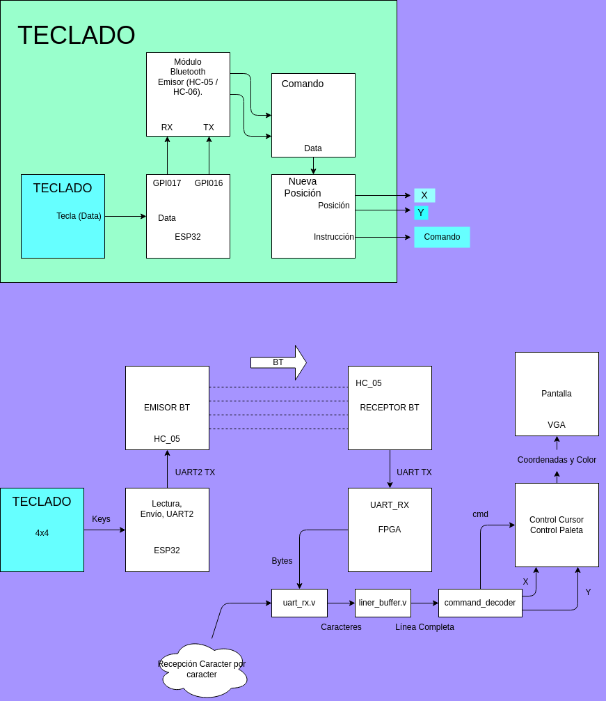
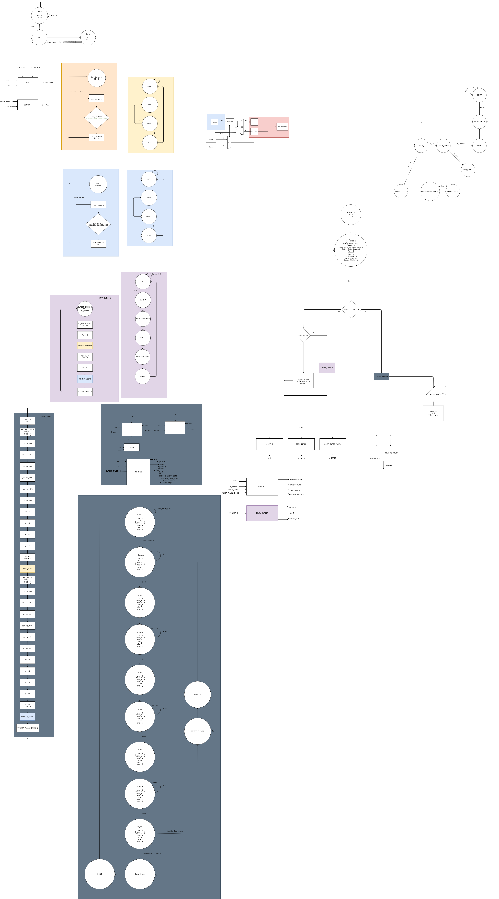
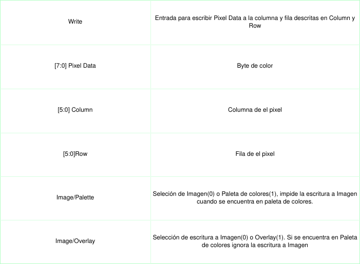

# Retro Paint

## Universidad Nacional De Colombia - Electrónica Digital I

## Autores

*Samuel Felipe Hernández Herreño - 102740044*

*Steven Sebastian Osorio Castro - 1022922007*

*Daniel Santiango Puentes Villabona - 1052378730*


## Dibuje y Visualice Pixel Art 64x64
Mediante el uso de un control y software dibuje en un lienzo de 64x64 pixeles con una profundidad de 8 bits por canal. Controle un teclado inalambrico y fluya a traves de la pantalla.

## Descripción General
Este proyecto implementa un sistema digital completo capaz de dibujar pixel art en una matriz 64×64 RGB utilizando un teclado 4×4 inalámbrico vía Bluetooth, un ESP32 y una FPGA como motor principal de procesamiento.

### El sistema permite:

Mover un cursor sobre un lienzo de 64×64 píxeles.

Cambiar el color actual (8 bits por canal — 24 bits RGB).

Pintar píxeles individuales.


Renderizar la matriz completa a 60 Hz.

La comunicación se realiza mediante un canal Bluetooth UART, desde el teclado → ESP32 → FPGA.
La FPGA decodifica comandos, controla el motor de dibujo y escribe los píxeles en cuadro de memoria.

## Objetivo General

Desarrollar un editor de Pixel Art 64×64 con control inalámbrico, capaz de dibujar y visualizar imágenes en una matriz LED RGB mediante una arquitectura digital implementada en FPGA.

## Requerimientos

### Hardware

- Matriz LED 64×64, 60 Hz, RGB 8 bits por canal.

- FPGA (cualquier con capacidad para framebuffer 64×64×24 bits).

- Un teclado 4×4 conectado por Bluetooth.

- Módulo Bluetooth → ESP32.

- Segundo módulo Bluetooth → FPGA (slave).

- Fuentes externas y reguladores.

### Software

- Firmware ESP32 (Bluetooth → UART → FPGA).

- Decodificador de comandos en Verilog.

- Motor de dibujo en Verilog (cursor + color + escritura de píxeles).

- Simulaciones Icarus Verilog + GTKWave.

- Renderizado en FPGA para enviar 64×64×24 bit al driver de la matriz.

- No portable

## Diagrama de Bloques General


## Arquitectura del Sistema


El sistema está dividido en los siguientes subsistemas:

### 1. Teclado Inalámbrico (4×4)


- El teclado entrega un código hexadecimal (0–F) por cada tecla.

- Se conecta al primer módulo Bluetooth.

- El ESP32 recibe, interpreta y envía comandos stringizados a la FPGA:

```Bash
CURSOR_UP\n
CURSOR_DOWN\n
COLOR_NEXT\n
PAINT\n
```

### 2. Firmware ESP32 (Bluetooth → UART)

Funciones:

- Recibe eventos desde el módulo Bluetooth.

- Convierte las teclas a señales binarias.

- Los transmite a la FPGA mediante UART a 115200 baudios.


### 3. UART RX en FPGA

Módulo uart_rx.v:

- Detecta start bit.

- Ensambla bytes.

Envía:

- rx_valid

- rx_byte
  
- ry_byte


### 4. Line Buffer

Módulo line_buffer.v:

- Convierte el stream de bytes a una línea completa terminada en \n.

Entrega:

- line_ready

- line_str[]

### 5. Command Decoder

Módulo command_decoder.v

Se encarga de interpretar cadenas como:
```Bash
"UP"
"PAINT"
"COLOR_R"
```
Y convertirlas a señales:

- cmd_valid

- cmd_id (enumeración de comandos)

- cmd_data

### 6. [Motor de Dibujo](./rtl/PAINT_ASM/)



Controla:

- Cursor (x,y)

- Color actual

- Write enable

- Dirección de escritura

- Color que se va a escribir

Funciones soportadas:

| Acción                            | Descripción                   |
| --------------------------------- | ----------------------------- |
| `UP`, `DOWN`, `LEFT`, `RIGHT`     | Movimiento del cursor         |
| `PAINT`                           | Escribir pixel                |
| `CLEAR`                           | Poner negro                   |
| `COLOR_R` / `COLOR_G` / `COLOR_B` | Cambiar color actual          |
| `MODE`                            | Cambiar entre modos de dibujo |

Salida del motor:

- Columna
- Fila
- Pintar
- Datos de pixel
- Seleccionar paleta
- Selecionar Overlay

### 7. [GPU](./rtl/GPU_ASM/)

Se encarga de cargar en la pantalla los datos almacenados en la memoria BRAM, expone una interfaz para escribir los datos en memoria.




## Estructura del Repositorio
```Bash
\retro_paint
  \diagrams
    aigen.png
    bloques.drawio
    control_pantalla.drawio
    distribucion.drawio
    paint.drawio
    read_teclado.drawio
  \hid
    Makefile
    bt_decoder.v
    read_teclado.png
    sim.out
    simulación.png
    tb_sistema.sv
    tec_esp_blu.ino
    top_fpga.v
    uart_rx.v
  \rtl
    \GPU_ASM
    \HID_ASM
    \PAINT_ASM
    \raw_implementation
      \building_blocks
  \scripts

```

## Implementación en la FPGA
Conecte módulo UART a el JTAG de la targeta.

Para experimentar una demostración vaya a la carpeta ```GPU_ASM``` y realice las conexiones segpun el archivo de asignación de pines[aqui](./rtl/GPU_ASM/pin_assignment.lpf) se encuentran las conexiones necesarias para el lado de la pantalla.

Para verficar las conexiones a JTAG use :
```
make detect
```

Para cargar la demostración utilice :
```
make configure_lattice
```

Presione el botón de reset y disfrute.


## [Rubrica de Coevaluación y Heteroevaluación](./Coevaluaciones-Autoevaluaciones)


#### Referencia del curso
El diseño sigue la metodología del texto Diseño de Sistemas Digitales — Carlos Iván Camargo
(Adjuntado por el profesor y usado como guía conceptual). Además, se utiliza como referencia el repositorio "digital_UN" y los demás referenciados al interior del presente proyecto

